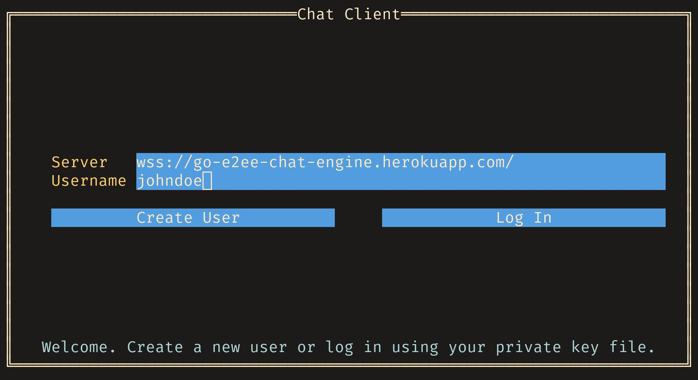
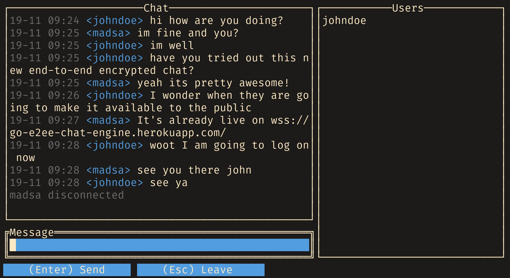

# go-e2ee-chat-engine

[](https://travis-ci.org/haakonleg/go-e2ee-chat-engine)
[](https://goreportcard.com/report/github.com/haakonleg/go-e2ee-chat-engine)
[](http://godoc.org/github.com/haakonleg/go-e2ee-chat-engine)
[](https://github.com/haakonleg/go-e2ee-chat-engine/releases/latest)
[](https://coveralls.io/github/haakonleg/go-e2ee-chat-engine?branch=master)

Golang chat engine backend with end-to-end encryption.
Project in the course IMT2681 Cloud Technologies, assignment 3.

## Project Description

The project idea is to develop a chat engine utilizing end-to-end encryption with RSA2048. Any registered user can create a chat room (with optional password), and others can join. Users in a chat room each have a private key (secret) and public key, and each users public key are stored on the server. When a user sends a message, he encrypts the message with each recipients public key. The backend server must keep track of connected users, public keys, chat rooms, encrypted messages. The communication between client and server will happen through a websocket.

The server will be deployed on Heroku as a Docker image. A simple (command line) demonstration client will be created.

## How it works

This project realizes end-to-end encryption in group chat scenarios (such as with chatrooms, in this case). To accomplish this, we use public key cryptography (RSA). Each client who wishes to register a user with the server, first generates an RSA keypair. The server then asks for the clients public key, which is stored in a mongoDB database. The server thus keeps track of each clients public key, to be able to exchange public keys between clients when in a chat session.

When a user joins a chat session, the public key of each user is sent by the server to every other participant in that chat room. Likewise, when a new user joins each participant of the chat room is notified about the new clients key. This is done so that clients can communicate with each other without ever exposing any unencrypted contents of a chat message while the message is transported across the internet. Encryption/decryption of messages is only done client-side, thus realizing end-to-end encryption.

At the moment, a client must create N encrypted copies of a message for N participating clients in a chat room. This is not an optimal solution. In the future a better solution would be to combine public key encryption with symmetric encryption algorithm (AES), and let each client generate a random encryption key which is encrypted with each recipients public key.

## Authentication

To authenticate clients (ie. prove that they are who they claim to be), we implemented a simple challenge-response authentication system. A client first sends a message to the server indicating they wish to log in as a particular user. The server, which keeps track of public keys associated with each user, then generates a random byte array of 64 characters and encrypts the content with the public key associated with this user. The byte array is sent to the client, and a response containing the unencrypted contents is expected. If the received unencrypted byte array matches the original generated by the server, the client is considered authenticated.

## Client-Server communication

The communication between clients and servers are realized using [Websockets](https://en.wikipedia.org/wiki/WebSocket). This provides a full-duplex realtime communication channel between both parties and is well suited for a scenario like this one (instant messaging).

The available message types that can be sent over the websocket are defined in `websock/messages.go`. Each message is contained in the struct `Message` which contains the type and contents of the message. For serialization of messages we use [gob](https://golang.org/pkg/encoding/gob/).

## Build

The project consists of two executables: the server and the example client.

### Server

The preferred method to build the server is via docker-compose. Simply run this command in the project root directory:
```
sudo docker-compose up -d --build
```

### Client

To build the client run this command in the root directory:
```
go build -o client cmd/client/*
```
Then simply execute the executable in the terminal (the client is using a terminal-based UI).

For a demo of the project without deploying the server yourself you can connect to this heroku deployment using the client:
[`wss://go-e2ee-chat-engine.herokuapp.com/`]().

This heroku deployment uses TLS for communication (Websocket Secure) and thus should be fairly secure.

## Screenshots





## Project report

### The original project plan

The original plan was to create a end-to-end encrypted chat engine. As a proof of concept we created a simplistic TUI (Terminal User Interface) which interacts with the server.

### Achieved goals

- Clients can participate in end-to-end encrypted chatrooms where each message is individually encrypted for each participant using RSA.
- Clients can quickly get an overview over how many users are currently logged on, and show a list of public chat rooms and participate in said chat rooms.
- Clients can create new chatrooms which may be both password protected and/or hidden from general view (users must explicitly type in the name of the chat room to join hidden rooms).
- Clients can login without using a password because the username is tied to the RSA public key. Authentication is performed using a simple challenge-response scheme.

### Unachieved goals

- There is no concept of moderators to control the contents of the chatrooms (we didn't have time to implement a concept of chat room owner/admin).
- A client cannot see messages from a chat room when not currently participating in said chat room.
- A client can only be part of a single chatroom at a time (ties into the above point).

### Things that went well

- Project management within the group

We used a feature branch and pull requests workflow on Github to highlight what changes our new additions would bring to the codebase. This means that all changes to the codebase are announced and reviewed by the other person. I think this both improved code quality and made it easier to follow the direction in the project.

- Integrating CI and deployment

Heroku makes it really easy to automatically deploy after the CI has completed successfully. This means that we know that the deployed version of the project is always the latest version which passed the CI. As this is our third project using Heroku it was really easy to setup the environment, as it is mostly similar to previous assignments.

### Things that did not go well

- Rewriting connection handling between users

The current handling could be subject to deadlocks if not properly handled. Using mutexes makes it very easy to make mistakes, hence this will probably impair further development of the service. However changing over to a different architecture would be a major refactor, because the use of mutexes is intertwined into all connection handlers. This is a good example of how tight coupling leads to systems which are hard to alter.

### Hard aspects of the project

One hard part of the project was defining how the server would internally pass messages between connected clients. Because each client is running in a separate goroutine, we need to make sure that we do not get deadlocks or race conditions.

At first the communication between clients was organized by a global map behind a mutex. This was embedded into the state of the server. This meant that in every handler we had to make sure that we did not read nor write to the map without obtaining the mutex. This was hard to manage and as the project scaled it was not sustainable.

The second iteration moved the map of users into a separate struct which would be implemented in a threadsafe way. The goal of this implementation was to provide an API of the type which would satisfy the needs of the application, while still encapsulating most of the mutexes. This proved to be challenging to implement because of the need to iterate over the map. We created an API which would access users and their connections threadsafely, however we needed to protect the inner type using a mutex which would be exposed to the consumer. This proved to be a slightly more ergonomic API to work with, however it still requires careful handling to prevent deadlocks.

As the API for communicating between clients was not optimal, work began to implement a channel-based solution. This solution was not completed in time mainly because the use of mutexes was tightly coupled into the connection handlers, so changing is time-consuming process.

### Lessons learned

- Working in as small steps as possible is normally beneficial

Small changes are easy to grasp and review for other project members, however it is not always feasible to make small changes, and on bigger changes the commit message should provide some more information.

- Start testing early

We had not written tests until far into the project. The interaction with databases and network connections make testing difficult so it's easy to ignore it. This meant that we had manually test the service after each change was made. This made it easy to introduce bugs and resulted in mistakes which could have been caught earlier. Writing tests before implementing features could be beneficial for a future project.

- Working with Git and GitHub

One of the contributors to the project was more experienced with Git than the other person, so I (haakonleg) learned a lot about the usage of Git. Specifically the usage of pull requests on GitHub, writing better commit messages, and rebasing. I had touched on these topics before, but never really used them in practice, so this was a valuable experience.

### Total work hours

Approximately 50 hours of work.
